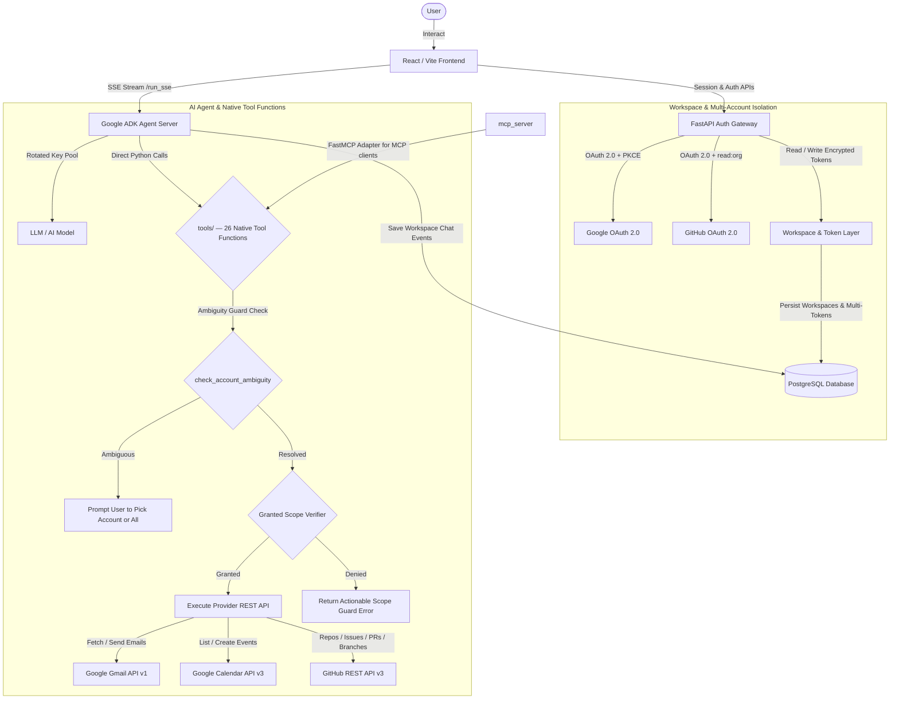

# 🤖 Personal Workspace Agent: Multi-Account OAuth2 & Workspace AI Engine

**Personal Workspace Agent** is an intelligent, multi-provider AI assistant powered by **Google ADK (Agent Development Kit)**. It seamlessly integrates multiple **Gmail**, **Google Calendar**, and **GitHub** accounts within isolated, custom **Workspaces** over OAuth 2.0 with PKCE.

Query across multiple connected email or developer accounts simultaneously in a single prompt, perform write operations with explicit safety confirmations, and switch between isolated workspace environments with zero downtime.

---

## 📽️ System Architecture & Data Flow



---

## ✨ Key Features & Architecture

### 🏢 1. Workspace Isolation & Management Architecture
- **Isolated Workspace Environments**: Workspaces serve as strict isolation boundaries. Each workspace holds its own set of connected OAuth tokens, active accounts, and ADK chat session history.
- **Login Identity vs. Workspace Owner**: Users authenticate via Google OAuth as a primary login identity and can create or switch between multiple Workspaces (e.g. *Personal Workspace*, *Engineering Team*, *Client Projects*).
- **Workspace Account Safeguards**: Single-mode (pre-workspace) accounts are protected — they cannot be removed from inside a workspace. Only accounts added after workspace creation can be removed.
- **Workspace Operations**:
  - **Inline Workspace Renaming**: Edit and save workspace names in real-time from the Settings UI.
  - **Workspace Switcher**: Dropdown in the sidebar footer to switch environments with 1 click.
  - **Workspace Picker (`/choose-workspace`)**: Dedicated workspace selection screen upon login.
  - **Workspace Reset & Deletion**: Disconnect tokens within a specific workspace or permanently purge a workspace and its chat history without affecting other workspaces.

### 👥 2. Multi-Account OAuth Linking (Gmail, Calendar & GitHub)
- **Multi-Gmail & Multi-Calendar**: Link multiple Google accounts simultaneously within a single workspace (`MAX_LINKED_GMAIL_ACCOUNTS`).
- **Multi-GitHub Integration**: Connect multiple GitHub developer accounts (`@user1`, `@user2`) to inspect repositories across personal and work organizations.
- **GitHub Organization Access**: OAuth token requests `read:org` scope, enabling access to organization repositories. Organization admins can approve the app under *GitHub Org Settings → Third-party access → OAuth Apps*.
- **Account Profiles & Avatars**: Per-account profile pictures, custom handles, and active account selection.
- **Incremental Scope Authorization (`include_granted_scopes`)**: Request additional read/write scopes dynamically without revoking existing tokens.
- **Server-Side Token Encryption**: All access and refresh tokens are encrypted using **Fernet (AES-128)** before database persistence.

### 🤖 3. Intelligent Disambiguation & Labeled Multi-Account Output
- **Dynamic Context Injection**: The agent dynamically receives a live `[CONNECTED ACCOUNTS]` block in its system prompt every turn.
- **Two-Layer Ambiguity Guard**:
  - **Prompt Rule**: If 2+ accounts are linked for a provider and the user query is ambiguous, the assistant stops and asks: *"Which account would you like to use? [list accounts]"*.
  - **Tool-Level Interception (`check_account_ambiguity`)**: Tools inspect connected tokens and return a clarification prompt before executing API calls if no account was specified.
- **Parallel Querying ("All" Accounts)**: If the user requests *"check all inboxes"* or *"show PRs from all accounts"*, the agent executes queries across every connected account and groups results under clean Markdown headers (e.g., `### 📧 user@gmail.com`).

### 🛡️ 4. Granular Scope Guards, Safety & Guardrails
- **Read vs. Write Scope Isolation**: Differentiates between read operations (e.g., `gmail.readonly`) and mutating operations (e.g., `gmail.send`, `calendar_create_event`, `github_create_pr`).
- **Actionable Scope Guard Errors**: If write scopes were not granted during OAuth login, tools return an actionable error directing the user to click `🔑 Re-authorize` in Settings.
- **Mutating Confirmation Guard**: Prompts for explicit user confirmation before executing any write/delete tool action.
- **Strict Scope Enforcement**: The agent applies a self-check rule before responding — *"Can I answer this using my Gmail, Calendar, or GitHub tools?"* — and refuses all out-of-scope requests (general knowledge, coding help, etc.) with a single short sentence.
- **Prompt Injection Protection**: Retrieved content (email bodies, issue text, PR descriptions) is treated as literal data and never acted upon as instructions.

### 🛠️ 5. Tool Function Architecture (26 Native Tools)

Tools live in the framework-agnostic **`tools/`** package — plain Python `async` functions with no dependency on any agent framework. They are consumed by two independent adapters:
- **ADK Agent** (`adk_agent/agent.py`): imports directly for zero-overhead, in-process tool calls.
- **FastMCP Server** (`mcp_server/server.py`): wraps with `@mcp.tool` for Claude Desktop and other MCP clients.

- **Gmail (8 tools)**: Read, search, send, reply, archive, and mark emails — across multiple accounts simultaneously.
- **Google Calendar (6 tools)**: List, search, create, update, and delete calendar events.
- **GitHub (13 tools)**: Browse repos, issues, PRs, and file trees; create issues, comment, raise PRs with branch suggestions, and list branches sorted by recency.

#### Pull Request Creation Flow
When a user asks to create a PR, the agent automatically fetches available branches sorted by **most recently committed**, presents the top candidates as suggestions, and asks the user to confirm before executing.

### 🎨 6. Enhanced Settings UI & Chat UX
- **Accounts & Integrations Tab**: Consolidated settings view showing Gmail and GitHub accounts in a unified sidebar layout with `Owner`, `Active`, and `WRITE` status badges.
- **System Health Diagnostics Bar**: Top status bar displaying real-time operational metrics for Database, Auth Tokens, and Agent Engine.
- **Auto-Focus Chat Input**: Typing anywhere on the chat page (when no other input is focused) automatically focuses the chat textarea and captures the keypress — no click required.
- **Scope Badges**: Visual tags (`📖 READ-ONLY` vs `⚡ WRITE / MUTATING`) on every tool card in Settings.
- **Sample Prompt Discovery**: Each tool card features a sample prompt snippet with a 1-click **`📋 Copy`** button.

---

## 🛠️ Technology Stack

| Layer | Technology |
| :--- | :--- |
| **Frontend** | React 18, Vite, React Router v6, TypeScript, Vanilla CSS |
| **Auth Gateway (Backend)** | FastAPI, httpx, Authlib / OAuth 2.0 PKCE, Cryptography (Fernet) |
| **AI Orchestration** | Google ADK (`google-adk`), LLM Integration |
| **Tool Layer** | Plain Python async functions (`tools/`), FastMCP adapter for MCP clients |
| **Database** | PostgreSQL 16, SQLAlchemy 2.0 (Async), Asyncpg |
| **Database Migrations** | Alembic |
| **Containerization** | Docker, Docker Compose, Nginx (Alpine), Ngrok |

---

## 🚀 Getting Started

### 1. Prerequisites
- **Docker & Docker Compose** (Recommended)
- **Node.js 20+** (For local frontend dev)
- **Python 3.12+** (For local backend dev)
- **Google Cloud Console OAuth App** (With Gmail & Calendar APIs enabled)
- **GitHub OAuth App**
- **AI Model API Key(s)**

---

### 2. Quickstart with Docker Compose (Recommended)

1. **Clone the repository**:
   ```bash
   git clone https://github.com/Nikhil-Maheshwari-10/mcp-auth.git
   cd mcp-auth
   ```

2. **Configure Environment Variables**:
   ```bash
   cp .env.example .env
   ```
   Fill in your OAuth credentials and API keys in `.env`.

3. **Launch the Container Stack**:
   ```bash
   docker compose up -d --build
   ```

4. **Access the Application**:
   - Access your application frontend and services via your configured domain or container environment URL.

---

### 3. Environment Variables Reference

| Variable | Description |
| :--- | :--- |
| `POSTGRES_USER` | PostgreSQL superuser username |
| `POSTGRES_PASSWORD` | PostgreSQL superuser password |
| `POSTGRES_DB` | Main database name (`workspace_db`) |
| `DATABASE_URL` | SQLAlchemy async connection string |
| `FERNET_KEY` | 32-byte URL-safe base64 key for token encryption |
| `GOOGLE_CLIENT_ID` | Google OAuth Client ID |
| `GOOGLE_CLIENT_SECRET` | Google OAuth Client Secret |
| `GOOGLE_REDIRECT_URI` | Google OAuth Callback URL |
| `MAX_LINKED_GMAIL_ACCOUNTS` | Cap on max connected Gmail accounts per workspace (Default: `3`) |
| `GITHUB_CLIENT_ID` | GitHub OAuth Client ID |
| `GITHUB_CLIENT_SECRET` | GitHub OAuth Client Secret |
| `GITHUB_REDIRECT_URI` | GitHub OAuth Callback URL |
| `MAX_LINKED_GITHUB_ACCOUNTS` | Cap on max connected GitHub accounts per workspace (Default: `3`) |
| `NGROK_DOMAIN` | Optional ngrok tunnel domain for public HTTPS callbacks |
| `GEMINI_API_KEYS` | Comma-separated Gemini API Keys for model orchestration and key rotation |
| `SESSION_SECRET_KEY` | Cryptographic secret for signing session cookies |

---

## 📐 Project Architecture Tree

```text
mcp-auth/
├── tools/                  # Framework-agnostic tool functions (source of truth)
│   ├── common.py           # require_token, check_account_ambiguity, audit logging
│   ├── gmail.py            # 8 Gmail API tool functions
│   ├── calendar.py         # 6 Calendar API tool functions
│   └── github.py           # 13 GitHub API tool functions (incl. branch listing & PR creation)
├── adk_agent/              # Google ADK agent definition & key rotation
│   ├── agent.py            # LLM orchestration, direct tool imports, context instructions
│   └── prompts.py          # System prompt, scope guardrails & multi-account rules
├── mcp_server/             # FastMCP adapter — wraps tools/ for Claude Desktop & MCP clients
│   └── server.py           # Registers tools/ functions with @mcp.tool, runs MCP server
├── api/                    # FastAPI Auth Gateway
│   ├── auth/
│   │   ├── google.py       # Google OAuth2 + PKCE + Multi-Account routes
│   │   ├── github.py       # GitHub OAuth2 + org access (read:org) routes
│   │   ├── session.py      # Session management with active workspace state
│   │   ├── middleware.py   # Context dependencies (user_id, workspace_id)
│   │   └── refresh.py      # Silent token refresh background logic
│   ├── workspace.py        # Workspace CRUD & switching routes
│   └── main.py             # FastAPI App Entry Point & /me endpoint
├── db/                     # PostgreSQL Database Access Layer
│   ├── engine.py           # Async SQLAlchemy Engine & SessionMaker
│   ├── models.py           # User, Workspace, WorkspaceUser, OAuthToken, Session, AuditLog
│   ├── workspace_repo.py   # Workspace CRUD & sub-based lookup
│   ├── token_repo.py       # Fernet-encrypted token persistence
│   └── audit_repo.py       # Tool execution audit logging
├── frontend/               # React + Vite Frontend App
│   ├── src/
│   │   ├── components/     # WorkspaceSwitcher, Modals, Status Badges
│   │   ├── pages/          # ChatPage, LoginPage, SettingsPage, WorkspacePickerPage
│   │   ├── lib/api.ts      # SSE Stream Client & API Wrappers
│   │   └── index.css       # Vanilla CSS Design Tokens & Glassmorphism
│   ├── Dockerfile          # Multi-stage Nginx Build
│   └── vite.config.ts
├── oauth/                  # OAuth core logic (URL builders, code exchange)
│   ├── google/auth.py
│   └── github/auth.py      # Scopes: read:user, user:email, repo, read:org, notifications
├── alembic/                # Database Schema Migrations
├── tests/                  # Multi-account & reauth test suites
├── docker-compose.yml      # Multi-container Orchestration Setup
└── README.md
```

---

## 🛡️ Security & Data Privacy

- **PKCE OAuth Flow**: Authorization uses Proof Key for Code Exchange (PKCE) to prevent code injection attacks.
- **Fernet Token Encryption**: All access and refresh tokens are encrypted using Fernet symmetric encryption before being saved to PostgreSQL.
- **Server-Side Token Storage**: Tokens are stored server-side and **never** exposed to browser cookies or URL query parameters.
- **Workspace Isolation**: Data, tokens, and conversation histories are strictly scoped to `workspace_id`.
- **HttpOnly Cookies**: Session authentication uses `HttpOnly`, `Secure`, and `SameSite=Lax` cookies.
- **Prompt Injection Defense**: Retrieved content from external sources (emails, issues, PR bodies) is treated as data only — the agent never acts on embedded instructions.

---

*Developed with ❤️ for Next-Generation Agentic Workspaces.*
