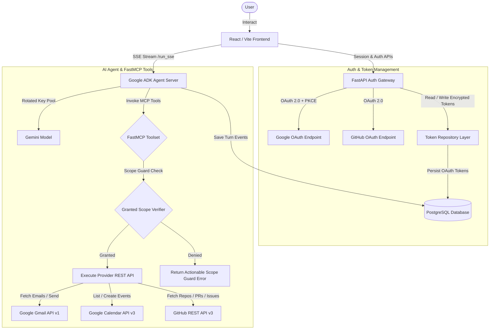

# 🤖 Personal Workspace Agent: OAuth2-Protected MCP AI Engine

**Personal Workspace Agent** is an intelligent, multi-provider AI assistant powered by **Google ADK (Agent Development Kit)** and **FastMCP**. It seamlessly integrates with your **Gmail**, **Google Calendar**, and **GitHub** accounts over OAuth 2.0 with PKCE, allowing you to query, search, compose emails, manage calendar events, inspect repositories, and create GitHub issues/PRs using natural language.

---

## 📽️ System Architecture & Data Flow



---

## ✨ Core Features

### 🌐 1. Ngrok & Flexible Domain Configuration
- **Ngrok Tunnel Integration**: Configured to support `ngrok` domain forwarding for public HTTPS OAuth redirects (`NGROK_DOMAIN`), making callback handling seamless during development and staging.
- **Localhost Flexibility**: Using `localhost` URLs is completely optional and intended for local testing on your own system.

### 🔐 2. Multi-Provider OAuth 2.0 Engine
- **Google OAuth 2.0 + PKCE**: Secure authorization for Gmail and Google Calendar.
- **GitHub OAuth 2.0**: OAuth integration for accessing repositories, issues, pull requests, and user profiles.
- **Incremental Scope Authorization (`include_granted_scopes`)**: Supports requesting additional read/write scopes dynamically without revoking existing user grants.
- **Automatic Token Rotation**: Background silent token renewal refreshes access tokens before expiration without user intervention.

### 🛡️ 3. Granular Scope Guards & Safety Controls
- **Read vs. Write Scope Isolation**: Differentiates between read operations (e.g. `gmail.readonly`) and write operations (e.g. `gmail.send`). Read operations continue to function even if write scopes were not granted.
- **Actionable Scope Guard Errors**: If an operation requires missing scopes, the tool returns a human-readable directive instructing the user on how to re-authorize in Settings.
- **Confirmation Modals**: UI confirmation prompts for high-impact actions like signing out or revoking credentials.

### 🛠️ 4. FastMCP Toolset Integration
The Google ADK Agent dynamically binds to a suite of FastMCP tools across three core workspace integrations:
- **Gmail Integration**: Fetch inbox messages, search emails, read email content, send new emails, reply to threads, archive messages, and mark emails as read.
- **Google Calendar Integration**: List upcoming events, search schedules, create new events, and delete events.
- **GitHub Integration**: Inspect user repositories, list and read issues/PRs, verify user identity, inspect repository file trees/content, create/close issues, post comments, and create pull requests.

### ⚡ 5. Google ADK Agent with Rotated API Keys
- **Google ADK Orchestration**: Uses Google Agent Development Kit (`google-adk`) for tool declaration and turn execution.
- **`RotatedGemini` Key Pool**: Automatically cycles through a pool of Gemini API keys on `429 ResourceExhausted` quota limits, ensuring zero downtime.
- **Progressive SSE Streaming**: Streams responses token-by-token directly to the frontend interface.

### 🎨 6. Premium UI & Stream Resilience
- **Glassmorphic Chat UI**: Built with React, Vite, and custom Vanilla CSS design tokens.
- **Real-Time Step Indicator**: Single-line status indicator (`↻ Listing GitHub repositories`) showing exact behind-the-scenes tool execution steps live.
- **`sessionStorage` Caching**: Chat state persists across navigation.
- **Auto-Recovery on Refresh**: Mid-stream page reloads query PostgreSQL and seamlessly resume or re-issue execution without hung loading spinners or duplicated responses.

---

## 🛠️ Technology Stack

| Layer | Technology |
| :--- | :--- |
| **Frontend** | React 18, Vite, React Router v6, React Markdown |
| **Auth Gateway (Backend)** | FastAPI, httpx, Authlib / OAuth 2.0 PKCE |
| **AI Orchestration** | Google ADK (`google-adk`), Gemini Model |
| **Tool Layer** | FastMCP (Model Context Protocol) |
| **Database** | PostgreSQL 16, SQLAlchemy 2.0, Asyncpg |
| **Database Migrations** | Alembic |
| **Containerization** | Docker, Docker Compose, Nginx (Alpine), Ngrok |

---

## 🚀 Getting Started

### 1. Prerequisites
- **Docker & Docker Compose** (Recommended)
- **Node.js 20+** (For local frontend dev)
- **Python 3.12+** (For local backend dev)
- **Google Cloud Console OAuth App** (With Gmail & Calendar APIs enabled)
- **GitHub OAuth App**
- **Google AI Studio API Key(s)**

---

### 2. Quickstart with Docker Compose (Recommended)

1. **Clone the repository**:
   ```bash
   git clone https://github.com/Nikhil-Maheshwari-10/mcp-auth.git
   cd mcp-auth
   ```

2. **Configure Environment Variables**:
   ```bash
   cp .env.example .env
   ```
   Fill in your OAuth credentials and Gemini API keys in `.env`.

3. **Launch the Container Stack**:
   ```bash
   docker compose up -d --build
   ```

> **Note on Domains & Local Testing**: By default, the application is configured to route OAuth redirects via an `ngrok` domain (`NGROK_DOMAIN`). Running on `localhost` is optional and intended for testing directly on your local system.

---

### 3. Environment Variables Reference

| Variable | Description |
| :--- | :--- |
| `POSTGRES_USER` | PostgreSQL superuser username |
| `POSTGRES_PASSWORD` | PostgreSQL superuser password |
| `POSTGRES_DB` | Main database name (`workspace_db`) |
| `DATABASE_URL` | SQLAlchemy async connection string |
| `GOOGLE_CLIENT_ID` | Google OAuth Client ID |
| `GOOGLE_CLIENT_SECRET` | Google OAuth Client Secret |
| `GOOGLE_REDIRECT_URI` | Google OAuth Callback URL (e.g. `https://${NGROK_DOMAIN}/auth/google/callback`) |
| `GITHUB_CLIENT_ID` | GitHub OAuth Client ID |
| `GITHUB_CLIENT_SECRET` | GitHub OAuth Client Secret |
| `GITHUB_REDIRECT_URI` | GitHub OAuth Callback URL (e.g. `https://${NGROK_DOMAIN}/auth/github/callback`) |
| `NGROK_DOMAIN` | Optional ngrok tunnel domain for public HTTPS callbacks |
| `GEMINI_API_KEYS` | Comma-separated Google AI Studio API Keys for key rotation |
| `SESSION_SECRET_KEY` | Cryptographic secret for signing session cookies |

---

### 4. Local Development (Without Docker)

#### Backend Setup
```bash
# 1. Create and activate virtual environment
python3 -m venv .venv
source .venv/bin/activate

# 2. Install dependencies
pip install -r requirements.txt

# 3. Run database migrations
alembic upgrade head

# 4. Start Auth API Gateway
uvicorn api.main:app --reload

# 5. Start ADK Agent (in separate terminal)
adk web adk_agent
```

#### Frontend Setup
```bash
cd frontend
npm install
npm run dev
```

---

## 📐 Project Architecture Tree

```text
mcp-auth/
├── adk_agent/              # Google ADK agent definition & key rotation
│   ├── __init__.py
│   └── agent.py            # RotatedGemini model & 25 native MCP tools
├── api/                    # FastAPI Auth Gateway
│   ├── auth/
│   │   ├── google.py       # Google OAuth2 + PKCE + Scope Guards
│   │   ├── github.py       # GitHub OAuth2 + Callback Error Handlers
│   │   ├── me.py           # User Profile & Connection Status
│   │   └── refresh.py      # OAuth Refresh Token Rotation Trigger
│   └── main.py             # FastAPI App Entry Point
├── db/                     # PostgreSQL Database Access Layer
│   ├── connection.py       # SQLAlchemy Async Engine & SessionMaker
│   ├── models.py           # User & OAuthToken Tables
│   └── token_repo.py       # Centralized OAuth Token Encrypted Storage
├── frontend/               # React + Vite Frontend App
│   ├── src/
│   │   ├── components/     # Navbar, Modals, Status Badges
│   │   ├── pages/          # ChatPage, LoginPage, SettingsPage
│   │   ├── lib/api.ts      # SSE Stream Client & Tool Formatter
│   │   └── index.css       # Vanilla CSS Design System & Glassmorphism
│   ├── Dockerfile          # Multi-stage Nginx Build
│   └── vite.config.ts
├── mcp_server/             # FastMCP Tool Implementations
│   └── tools/
│       ├── gmail.py        # Gmail API Tools + Scope Guard Handlers
│       ├── calendar.py     # Calendar API Tools + Scope Guards
│       └── github.py       # GitHub API Tools + Exception Handlers
├── alembic/                # Database Migrations
├── docker-compose.yml      # Multi-container Orchestration Setup
└── requirements.txt        # Python Dependencies
```

---

## 🛡️ Security & Data Privacy

- **PKCE Flow**: Google OAuth uses Proof Key for Code Exchange (PKCE) to prevent authorization code injection attacks.
- **Server-Side Token Storage**: Authorization codes are exchanged server-to-server. Raw access tokens are **never** exposed to the client browser or URL query parameters.
- **HttpOnly Cookies**: Session authentication uses `HttpOnly` and `SameSite=Lax` cookies.
- **Encrypted Token Isolation**: OAuth tokens are centralized inside `token_repo.py` with strict schema validation.

---

*Developed with ❤️ for Next-Generation Agentic Workspaces.*
